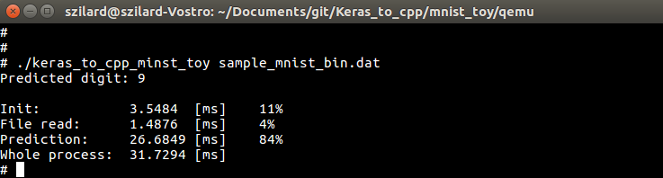
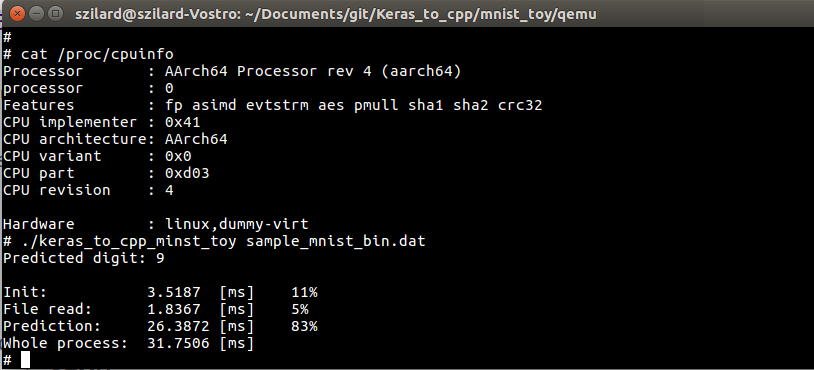
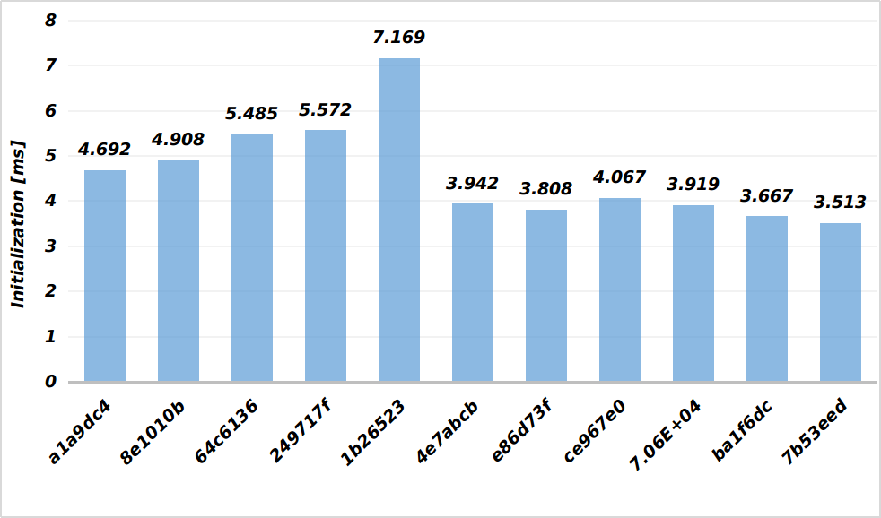
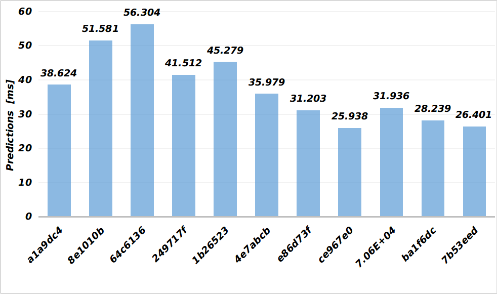
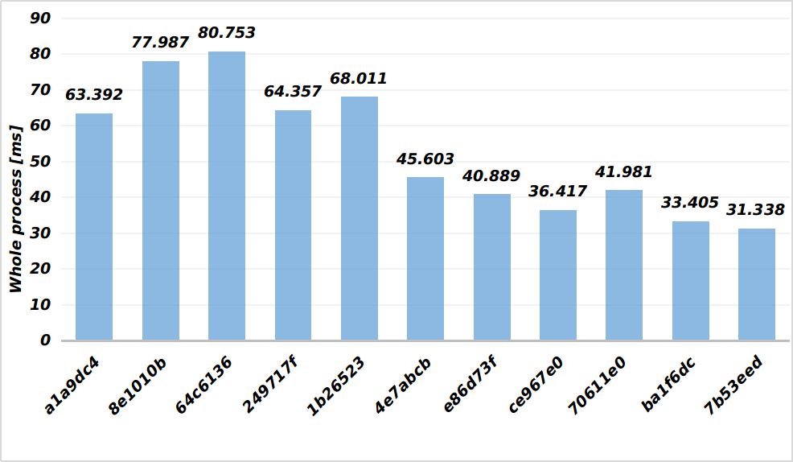

# **Toy** MNIST model

## Project structure

```
├── mnist_toy
│   ├── Debug
│   │   ├── makefile
│   │   ├── objects.mk
│   │   ├── sources.mk
│   │   └── src
│   │       └── subdir.mk
│   ├── dumped.nnet
│   ├── nn_file_gen
│   │   ├── dump_to_simple_cpp.py
│   │   ├── dump_to_simple_cpp_source_gen.py
│   │   └── mnist_toy_model.ipynb
│   ├── qemu
│   │   ├── aarch64-linux-3.15rc2-buildroot.img
│   │   └── qemu_shared
│   │       ├── dumped.nnet
│   │       ├── keras_to_cpp_minst_toy
│   │       ├── makefile
│   │       ├── sample_mnist_bin.dat
│   │       └── sample_mnist.dat
│   ├── sample_mnist_bin.dat
│   ├── sample_mnist.dat
│   └── src
│       ├── dumped.h
│       ├── keras_to_cpp_minst_toy.cpp
│       ├── NnLayer.cpp
│       ├── NnLayer.h
│       ├── nnVector.h
│       ├── Utilities.cpp
│       └── Utilities.h
├── README.md
└── README.pdf
```

## 1. Implement the trained model for a Cortex A53 processor in C or C++. You can only use standard libraries.

### 1.1. Generate JSON, and store weights
```python
# store model
with open('./my_nn_arch.json', 'w') as fout:
    fout.write(model.to_json())
model.save_weights('./my_nn_weights.h5', overwrite=True)
```
### 1.2. Generate plain text and header files
```bash
$ python h5_to_dumped_h.py -a my_nn_arch.json -w my_nn_weights.h5 -o ../dumped.nnet -v 1
$ python h5_to_dumped_nnet.py -a my_nn_arch.json -w my_nn_weights.h5 -o ../src/dumped.h -v 1
```
### 1.3. Importing generated files
The program can work in 2 modes, in *modifiable* and *fixed* weights. In *modifiable* weights* mode, the program reads the neural network weights from an external .nnet file, which can be given as an argument in the command line. In this case, the neural network architecture and weights are determined in the external file. The architecture construction and weight loading process are handled in ```NeuralNetwork::load_weights()``` function in [NnLayer.cpp](mnist_toy/src/NnLayer.cpp) file. 
In the fixed weights mode, the neural network architecture is created manually in [keras_to_cpp_minst_toy.cpp](mnist_toy/src/keras_to_cpp_minst_toy.cpp) file in the main function and weights are save in [dumped.h](mnist_toy/src/dumped.h) file. With this solution, the initialization process can be more than 120x faster compared to the first mode.

### 1.4. Updating weights

The output of the Dense layer is calculated with this formula:

| *W - Weights of the current layer* | *X - Input*               |
| ----------------- | -------------  |
| ***B - Bias***                     | ***σ - activation function*** |
| ***Y - Layer output***             |                           |

<center>  <code>y = σ( transpose(W) * X + transpose(B) )</code>  </center>

### 1.5. Prediction
The whole prediction is done in ```NeuralNetwork::predict()``` function in [NnLayer.cpp](mnist_toy/src/NnLayer.cpp). For the generalization output and the input is also a vector_2d variable. The classified number is the of the output vector's biggest element. 
```c++
vector_2d NeuralNetwork::predict(const vector_2d &input) {
	vector_2d temp = input;
	for(auto layer : m_layers) {
		temp = layer->get_output(temp);
	}
	return temp;
}
```

## 2. Deliver the application as source code and build scripts and the resulting binary that can run in qemu simulator.

### 2.1. Set up Qemu

* Download AARCH64 build root image [aarch64-linux-3.15rc2-buildroot.img](https://github.com/675816156/Qemu-aarch64) 

* Run the virtual machine: [source]((https://www.bennee.com/~alex/blog/2014/05/09/running-linux-in-qemus-aarch64-system-emulation-mode/)) 
```bash
$ qemu-system-aarch64 -machine virt -cpu cortex-a53 -machine type=virt \
-nographic -smp 1 -m 2048 -kernel aarch64-linux-3.15rc2-buildroot.img  \
--append "console=ttyAMA0"
```

* Exit from Qemu console 
``` Ctrl-A X ```

* Share “/home/szilard/qemu/bennee/qemu_shared” folder with Qemu virtual machine:
```bash
$ qemu-system-aarch64 -machine virt -cpu cortex-a53 -machine type=virt \
 -nographic -smp 1 -m 2048 -kernel aarch64-linux-3.15rc2-buildroot.img  \
--append "console=ttyAMA0" \
-fsdev local,id=r,path=/home/szilard/Documents/git/Keras_to_cpp/mnist_toy/qemu/qemu_shared,security_model=none \
-device virtio-9p-device,fsdev=r,mount_tag=r
```

* Mount the shared folder:
``` $ mount -t 9p -o trans=virtio r /mnt ```

### 2.2. Cross compiling for Cortex A53
* Compile a single file named helloworld.cpp

```$ arm-linux-gnueabi-g++ helloword.cpp -o helloword-arm-cpp -static```

* [Build scripts file](mnist_toy/qemu/qemu_shared/makefile)

## 3. The application must accept input files of 28x28 bytes containing MNIST handwritten digits and must output the predicted digit on the console and the execution time

* Binary image reading is implemented in ```Utilities::read_from_binary_file()``` function in [Utilities.cpp](mnist_toy/src/Utilities.cpp). After the file reading 
* Run the execution file in fixed weights mode:

``` $ ./keras_to_cpp_minst_toy sample_mnist_bin.dat ```



- Run the execution file in Modifiable weights mode:

``` $ ./keras_to_cpp_minst_toy sample_mnist_bin.dat dumped.nnet  ```

## 4. Demonstrate that you have actually run this application on an ARM CPU or in a simulator.

### 4.1. Run results


### 4.2. Modifiable and fixed weights (float)

| Process name      | Modifiable weights [ms]  | Fixed weights [ms] |
| ----------------- | -------------: | -------------: |
| Initialization | 569.081	 | 3.518    |
| File read    	| 1.384	     | 1.836    |
| Prediction   	| 29.702	 | 26.387   |
| Whole process	| 600.178	 | 31.750   |

### 4.3. Speed difference in float, double and long double calculation

The calculation type can be determined in [nnVector.h](mnist_toy/src/nnVector.h)

| Process name      | Float [ms]     | Double [ms]   |Long Double [ms]|
| ----------------- | -------------: | -------------:|-------------:  |
| Initialization 	| 	3.5135       | 4.17146	     |4.0997	      |
| File read    	 	| 	1.4148       | 1.27158	     |1.2669	      |
| Prediction   	 	|  26.4019       | 34.8526       |35.1715	      |
| Whole process	 	|  31.3385       | 40.3045	     |40.5475	      |

### 4.4. Execution time changes in commits (float)










## 5. Outline your ideas on improving this model in speed and accuracy

### 5.1. Improve speed

* Use processors which have built-in [NPU](https://www.96boards.org/product/tb-96aiot/)
* Use SIMD and Floating-point support at matrix multiplication
* Use the float type for calculations

### 5.2. Improve accuracy

* Use the double or the long double types for calculations
* Generate validation set from the training set. With the validation set, we can get the quality of our results, and we can detect overfitting.
* Increase the data set size with image augmentation. We can use for example blurring, scaling, zooming, and sharpening. With augmentation, we can get more generalized results.
* Use a convolutional neural network for this image classification task to increase robustness. In this case, the neural network doesn't focus on the whole image, rather than only on image features. The [Kaggle](https://www.kaggle.com/saurabhyadav919/mnist-kernel) architecture is much more complicated, but we can get 99.3% accuracy.
